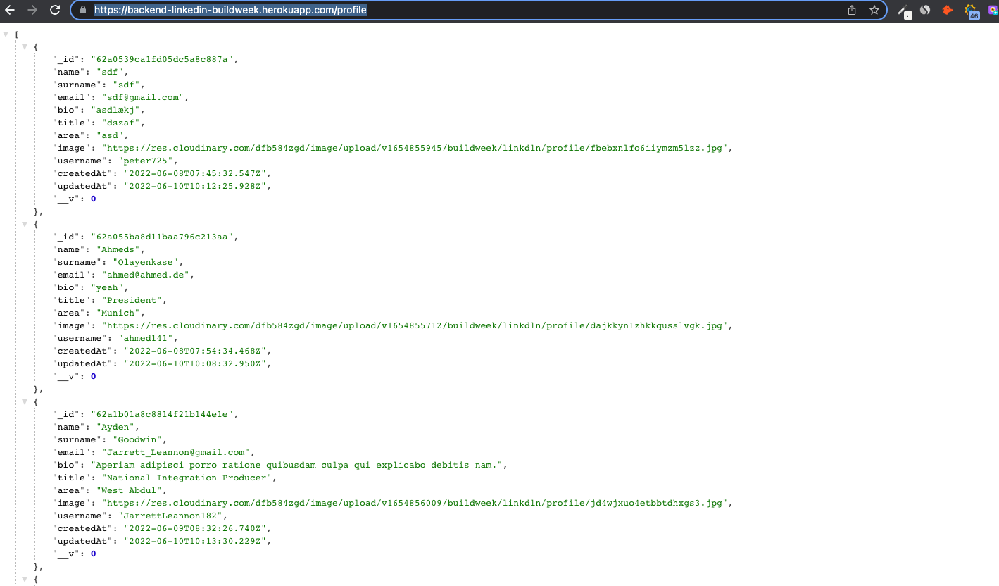

<h1>A LinkedIn Backend Clone - Hosted on Heroku - build using NodeJS / ExpressJS and MongoDB</h1>

This was a backend for a fictitious LinkedIn. It contains the ability to add experiences to edit your profile, add experiences, pictures as well as downloading your profile as a PDF documents or and to download your experiences as a CSV document.  You can see the backend here on Heroku: https://backend-linkedin-buildweek.herokuapp.com/profile .

The backend was built using Node and Express.js. Router wise it includes CRUD for "profile" and "experiences" as well as an endpoint for the download of the profile as a pdf-document as well as the endpoint to download experiences as a CSV-document.  

<h2>Technologies used:</h2>

- Mongoose

- Express

- Node

- NPM

- GIT

- MongDB

- Heroku

